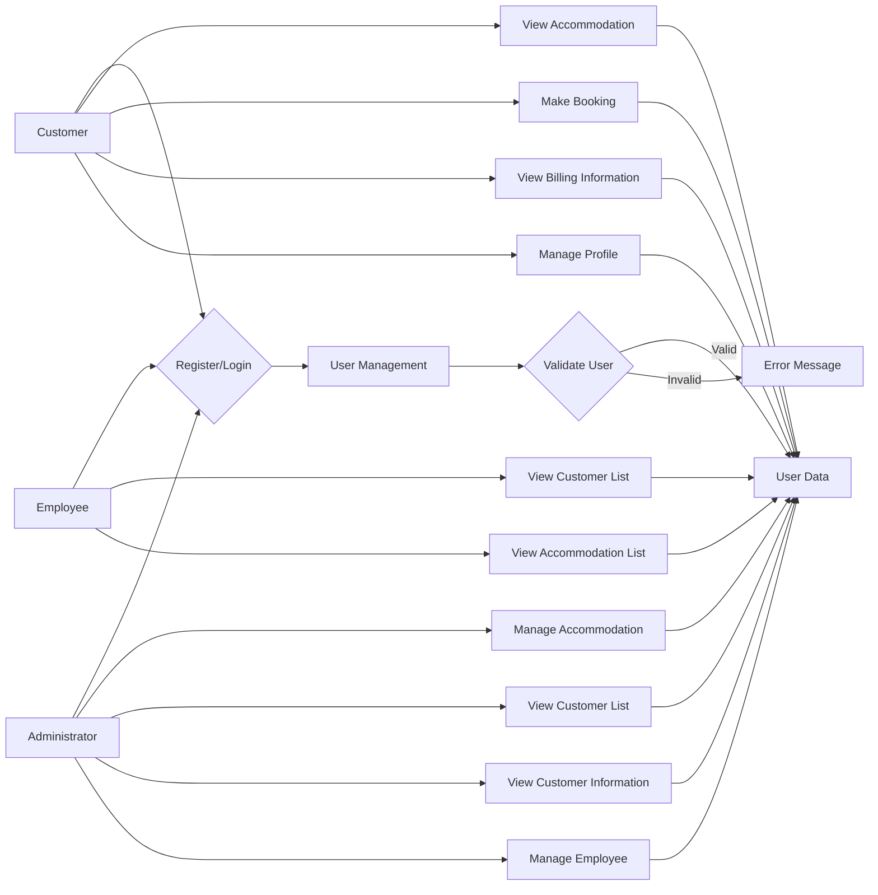

# Final C project

## Diagram

```mermaid
graph LR
    A[Customer] --> B{Register/Login}
    C[Employee] --> B
    D[Administrator] --> B

    B --> E[User Management]
    E --> F{Validate User}
    F -- Valid --> G[User Data]
    F -- Invalid --> H[Error Message]

    A --> I[View Accommodation]
    I --> G
    A --> J[Make Booking]
    J --> G
    A --> K[View Billing Information]
    K --> G
    A --> L[Manage Profile]
    L --> G

    C --> M[View Customer List]
    M --> G
    C --> N[View Accommodation List]
    N --> G

    D --> O[Manage Accommodation]
    O --> G
    D --> P[View Customer List]
    P --> G
    D --> Q[View Customer Information]
    Q --> G
    D --> R[Manage Employee]
    R --> G
```
