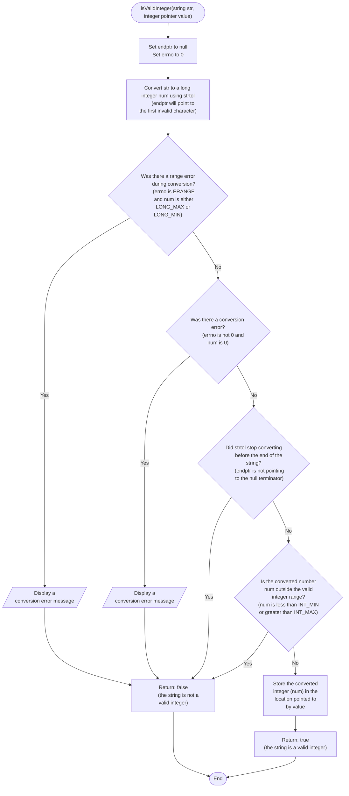
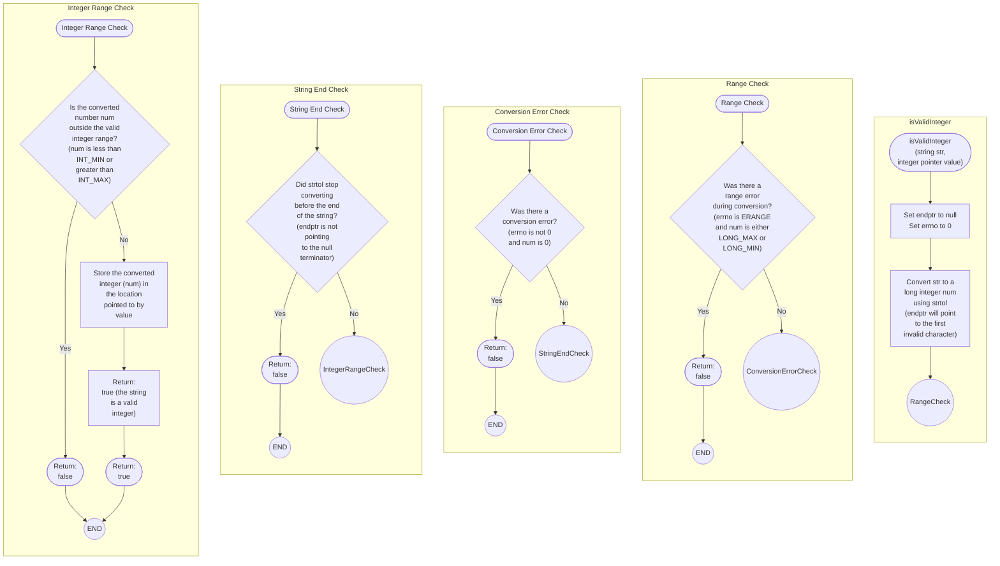

```c
bool isValidInteger(const char *str, int *value) {
  char *endptr;

  // Convert string to long
  errno = 0; // Reset errno
  long num = strtol(str, &endptr, 10);

  // Check for conversion errors
  if ((errno == ERANGE && (num == LONG_MAX || num == LONG_MIN)) ||
      (errno != 0 && num == 0)) {
    perror("strtol");
    return false;
  }

  // Check if the entire string was consumed
  if (*endptr != '\0') {
    return false; // Not a valid integer
  }

  // Check for range (INT_MIN to INT_MAX)
  if (num < INT_MIN || num > INT_MAX) {
    return false;
  }

  // Store the converted integer
  *value = (int)num;

  return true;
}

```




