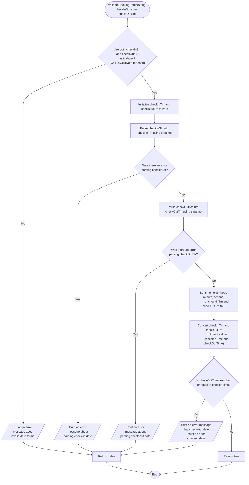
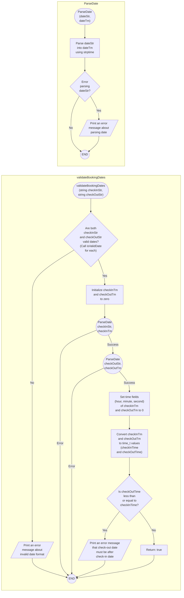

```c
bool validateBookingDates(const char *checkInStr, const char *checkOutStr) {
  if (!isValidDate(checkInStr) || !isValidDate(checkOutStr)) {
    printf("Invalid date format. Please use YYYY-MM-DD.\n");
    return false;
  }

  struct tm checkInTm = {0}, checkOutTm = {0};

  // Parse the date strings using strptime
  if (!strptime(checkInStr, "%Y-%m-%d", &checkInTm)) {
    printf("Error parsing check-in date.\n");
    return false;
  }
  if (!strptime(checkOutStr, "%Y-%m-%d", &checkOutTm)) {
    printf("Error parsing check-out date.\n");
    return false;
  }

  // Set time to 0 to compare only dates
  checkInTm.tm_hour = 0;
  checkInTm.tm_min = 0;
  checkInTm.tm_sec = 0;
  checkOutTm.tm_hour = 0;
  checkOutTm.tm_min = 0;
  checkOutTm.tm_sec = 0;

  time_t checkInTime = mktime(&checkInTm);
  time_t checkOutTime = mktime(&checkOutTm);

  if (checkOutTime <= checkInTime) {
    printf("Check-out date must be after check-in date.\n");
    return false;
  }

  return true;
}
```




