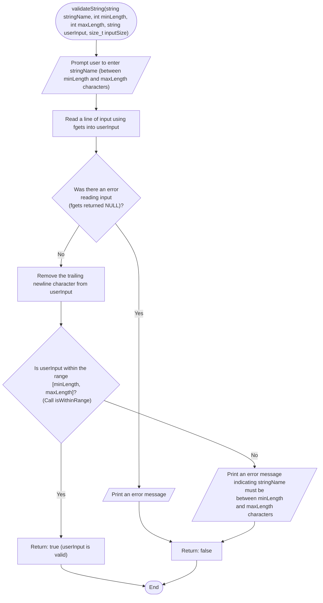

```c
bool validateString(const char *stringName, int minLength, int maxLength,
                    char *userInput, size_t inputSize) {
  printf("Enter %s (between %d and %d characters): ", stringName, minLength,
         maxLength);

  // Read a line of input using fgets
  if (fgets(userInput, inputSize, stdin) == NULL) {
    fprintf(stderr, "Error reading input.\n");
    return false;
  }

  // Remove the trailing newline character from fgets
  userInput[strcspn(userInput, "\n")] = 0;

  if (!isWithinRange(userInput, minLength, maxLength)) {
    printf("%s must be between %d to %d characters long.\n", stringName,
           minLength, maxLength);
    return false;
  }

  return true;
}
```


