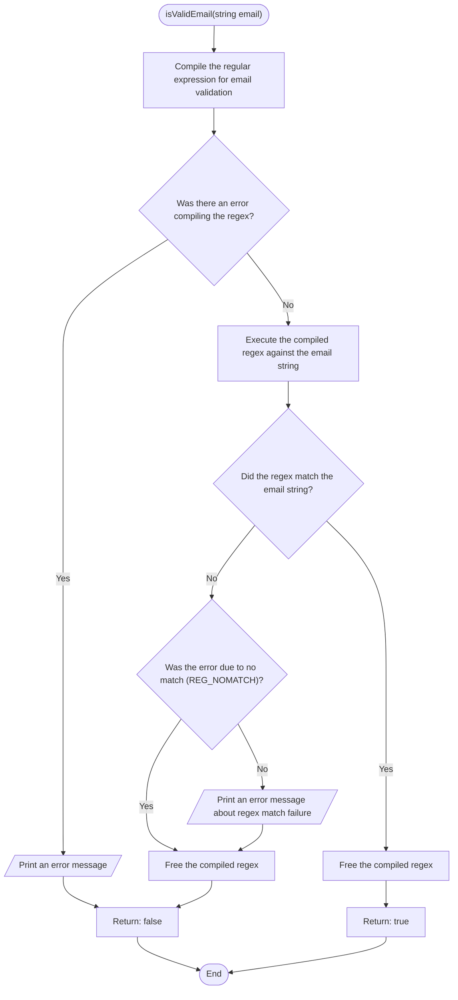

```c
bool isValidEmail(const char *email) {
  regex_t regex;
  int reti;
  char msgbuf[100];

  // Regex Compilation:
  reti = regcomp(&regex, "^[a-zA-Z0-9._%+-]+@[a-zA-Z0-9.-]+\\.[a-zA-Z]{2,}$",
                 REG_EXTENDED);
  if (reti) {
    fprintf(stderr, "Could not compile regex\n");
    return false;
  }

  // Regex Execution:
  reti = regexec(&regex, email, 0, NULL, 0);
  if (!reti) {
    regfree(&regex);
    return true; // Match found
  } else if (reti == REG_NOMATCH) {
    regfree(&regex);
    return false; // No match
  } else {
    regerror(reti, &regex, msgbuf, sizeof(msgbuf));
    fprintf(stderr, "Regex match failed: %s\n", msgbuf);
    regfree(&regex);
    return false;
  }
}
```



```mermiad
graph TB
    subgraph isValidEmail [isValidEmail]
        direction TB
        start(["isValidEmail\n(string email)"]) --> 1

        1["Compile the\nregular expression\nfor email validation"] --> 2

        2{"Was there an\nerror compiling\nthe regex?"}
        2 -- Yes --> 3
        2 -- No --> 4

        3[/"Print an error\nmessage"/] --> 7

        4["Execute the\ncompiled regex\nagainst the\nemail string"] --> 5

        5{"Did the regex\nmatch the\nemail string?"}
        5 -- Yes --> 6
        5 -- No --> 8

        6["Free the\ncompiled regex"] --> 9

        7["Return: false"] --> end1

        8{"Was the error\ndue to no match\n(REG_NOMATCH)?"}
        8 -- Yes --> 10
        8 -- No --> 11

        9["Return: true"] --> end1

        10["Free the\ncompiled regex"] --> 7

        11[/"Print an error\nmessage about\nregex match failure"/] --> 10

        end1(["END"])
    end
```
