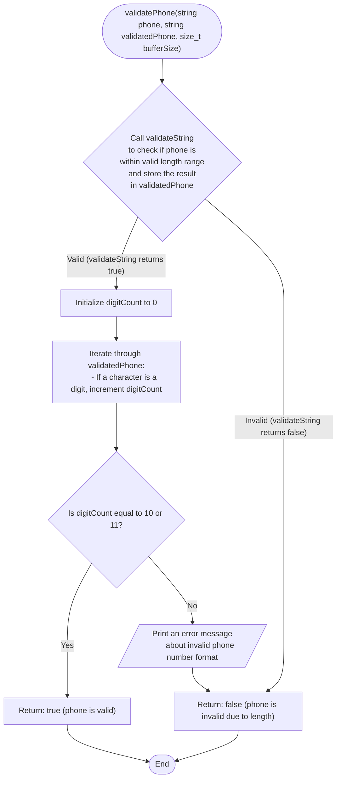

```c
bool validatePhone(const char *phone, char *validatedPhone, size_t bufferSize) {
  if (!validateString("Phone", 10, 11, validatedPhone,
                      bufferSize)) { // Adjust length as needed
    return false;
  }

  int digitCount = 0;
  for (int i = 0; validatedPhone[i] != '\0'; i++) {
    if (isdigit(validatedPhone[i])) {
      digitCount++;
    }
  }

  if (digitCount != 10 && digitCount != 11) {
    printf(
        "Invalid phone number format. Please enter a 10 or 11 digit number.\n");
    return false;
  }

  return true;
}
```


