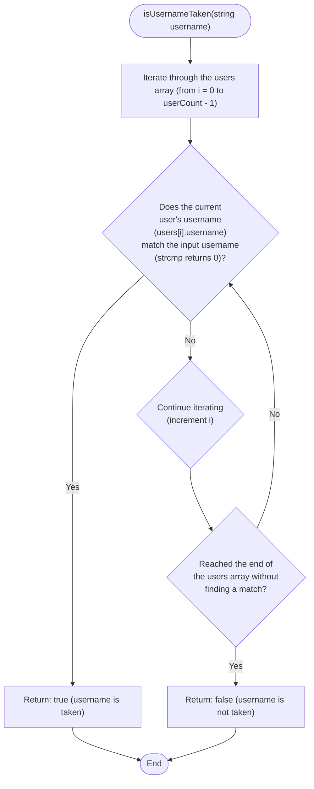

```c
bool isUsernameTaken(const char *username) {
  for (int i = 0; i < userCount; i++) {
    if (strcmp(users[i].username, username) == 0) {
      return true;
    }
  }
  return false;
}
```


```mermaid
flowchart TB
    start(["isUsernameTaken(string username)"])
    start --> 1

    1["Iterate through the users array (from i = 0 to userCount - 1)"]
    1 --> 2

    2{"Does the current
        user's username
        (users[i].username)
        match the input username
        (strcmp returns 0)?"}
    2 -- Yes --> 3
    2 -- No --> 4

    3["Return: true (username is taken)"]
    3 --> end1

    4{"Continue iterating
        (increment i)"}
    4 --> 5

    5{"Reached the end of
        the users array without
        finding a match?"}
    5 -- Yes --> 6
    5 -- No --> 2

    6["Return: false (username is not taken)"]
    6 --> end1

    end1(["End"])
```
