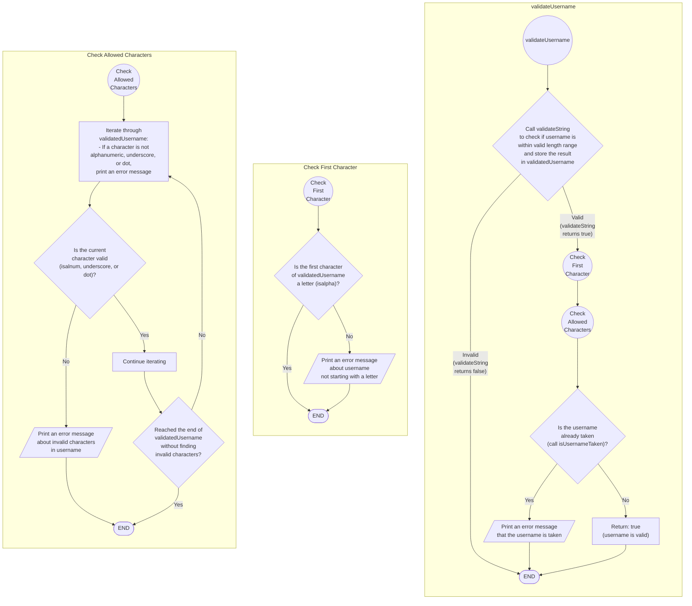

```c
bool validateUsername(const char *username, char *validatedUsername,
                      size_t bufferSize) {
  if (!validateString("Username", 5, 49, validatedUsername, bufferSize)) {
    return false;
  }

  // Check if the first character is a letter
  if (!isalpha(validatedUsername[0])) {
    printf("Username must start with a letter.\n");
    return false;
  }

  // Check for allowed characters
  for (int i = 0; validatedUsername[i] != '\0'; i++) {
    if (!isalnum(validatedUsername[i]) && validatedUsername[i] != '_' &&
        validatedUsername[i] != '.') {
      printf("Username can only contain alphanumeric characters, underscores, "
             "and dots.\n");
      return false;
    }
  }

  if (isUsernameTaken(validatedUsername)) {
    printf("Username already taken.\n");
    return false;
  }

  return true;
}
```



