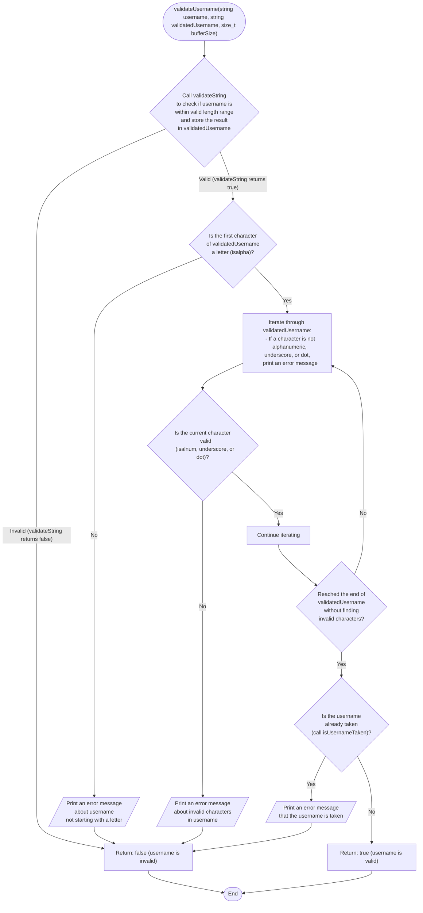

```c
bool validateUsername(const char *username, char *validatedUsername,
                      size_t bufferSize) {
  if (!validateString("Username", 5, 49, validatedUsername, bufferSize)) {
    return false;
  }

  // Check if the first character is a letter
  if (!isalpha(validatedUsername[0])) {
    printf("Username must start with a letter.\n");
    return false;
  }

  // Check for allowed characters
  for (int i = 0; validatedUsername[i] != '\0'; i++) {
    if (!isalnum(validatedUsername[i]) && validatedUsername[i] != '_' &&
        validatedUsername[i] != '.') {
      printf("Username can only contain alphanumeric characters, underscores, "
             "and dots.\n");
      return false;
    }
  }

  if (isUsernameTaken(validatedUsername)) {
    printf("Username already taken.\n");
    return false;
  }

  return true;
}
```



graph TB
subgraph isValidInteger [isValidInteger]
direction TB
start(["isValidInteger\n(string str,\ninteger pointer value)"]) --> 1

        1["Set endptr to null\nSet errno to 0"] --> 2

        2["Convert str to a\nlong integer num\nusing strtol\n(endptr will point\nto the first\ninvalid character)"] --> RC(("RangeCheck"))

        subgraph RangeCheck [Range Check]
            direction TB
            RC
            RCStart(["Range Check"]) --> 3
            3{"Was there a\nrange error\nduring conversion?\n(errno is ERANGE\nand num is either\nLONG_MAX or\nLONG_MIN)"}
            3 -- Yes --> E1(("END_1"))
            3 -- No --> CEC(("ConversionErrorCheck"))
        end

        subgraph ConversionErrorCheck [Conversion Error Check]
            direction TB
            CEC
            CEStart(["Conversion Error Check"]) --> 5
            5{"Was there a\nconversion error?\n(errno is not 0\nand num is 0)"}
            5 -- Yes --> E2(("END_2"))
            5 -- No --> SEC(("StringEndCheck"))
        end

        subgraph StringEndCheck [String End Check]
            direction TB
            SEC
            SEStart(["String End Check"]) --> 8
            8{"Did strtol stop\nconverting\nbefore the end\nof the string?\n(endptr is not\npointing\nto the null\nterminator)"}
            8 -- Yes --> E3(("END_3"))
            8 -- No --> IRC(("IntegerRangeCheck"))
        end

        subgraph IntegerRangeCheck [Integer Range Check]
            direction TB
            IRC
            IRStart(["Integer Range Check"]) --> 9
            9{"Is the converted\nnumber num\noutside the valid\ninteger range?\n(num is less than\nINT_MIN or\ngreater than\nINT_MAX)"}
            9 -- Yes --> E4(("END_4"))
            9 -- No --> 10

            10["Store the converted\ninteger (num) in\nthe location\npointed to by\nvalue"] --> 11
            11["Return:\ntrue (the string\nis a valid\ninteger)"] --> E4
        end
    end
