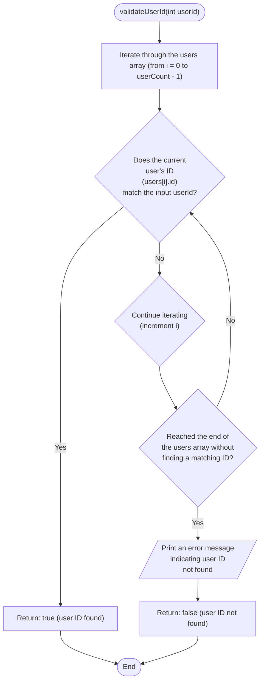

```c
bool validateUserId(int userId) {
  for (int i = 0; i < userCount; i++) {
    if (users[i].id == userId) {
      return true;
    }
  }
  printf("User with ID %d not found.\n", userId);
  return false;
}
```


