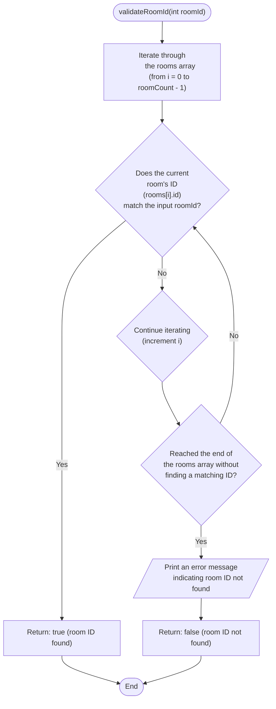

```c
bool validateRoomId(int roomId) {
  for (int i = 0; i < roomCount; i++) {
    if (rooms[i].id == roomId) {
      return true; // Room ID found
    }
  }
  printf("Room with ID %d not found.\n", roomId);
  return false; // Room ID not found
}
```


