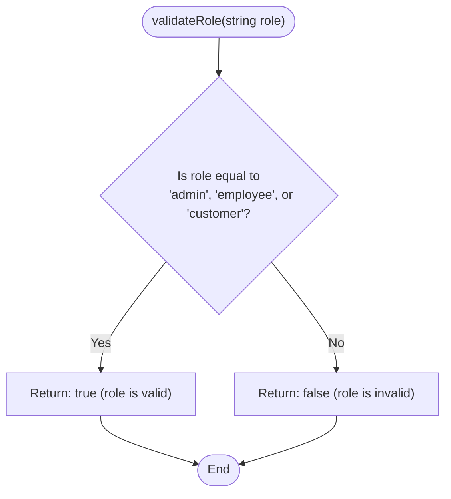

```c
bool validateRole(const char *role) {
  return (strcmp(role, "admin") == 0 || strcmp(role, "employee") == 0 ||
          strcmp(role, "customer") == 0);
}
```


```mermaid
flowchart TB
    start(["validateRole(string role)"])
    start --> 1

    1{"Is role equal to
        'admin', 'employee', or 'customer'?"}
    1 -- Yes --> 2
    1 -- No --> 3

    2["Return: true (role is valid)"]
    2 --> end1

    3["Return: false (role is invalid)"]
    3 --> end1

    end1(["End"])
```
