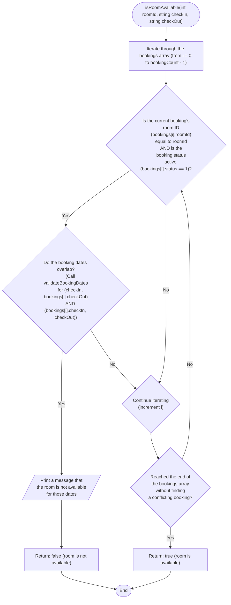

```c
bool isRoomAvailable(int roomId, const char *checkIn, const char *checkOut) {
  for (int i = 0; i < bookingCount; i++) {
    if (bookings[i].roomId == roomId &&
        bookings[i].status == 1) { // Assuming status 1 means active booking
      // Check for date overlap
      if (validateBookingDates(checkIn, bookings[i].checkOut) &&
          validateBookingDates(bookings[i].checkIn, checkOut)) {
        printf("Room is not available for those dates.\n");
        return false;
      }
    }
  }
  return true; // Room is available
}
```


