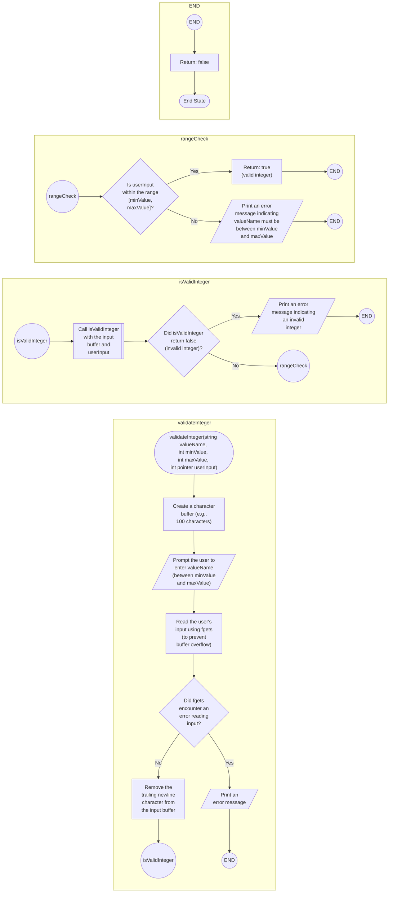

```c
// Function to validate an integer input with range check and buffer overflow
// prevention
bool validateInteger(const char *valueName, int minValue, int maxValue,
                     int *userInput) {
  char buffer[100]; // Buffer to store input string (adjust size as needed)

  printf("Enter %s (between %d and %d): ", valueName, minValue, maxValue);

  // Read input using fgets to prevent buffer overflow
  if (fgets(buffer, sizeof(buffer), stdin) == NULL) {
    fprintf(stderr, "Error reading input.\n");
    return false;
  }

  // Remove the trailing newline character from fgets
  buffer[strcspn(buffer, "\n")] = 0;

  // Convert and validate the integer
  if (!isValidInteger(buffer, userInput)) {
    printf("Invalid %s. Please enter a valid integer.\n", valueName);
    return false;
  }

  // Check if the integer is within the allowed range
  if (*userInput < minValue || *userInput > maxValue) {
    printf("%s must be between %d and %d.\n", valueName, minValue, maxValue);
    return false;
  }

  return true;
}
```


