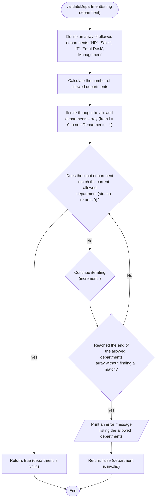

```c
bool validateDepartment(const char *department) {
  const char *allowedDepartments[] = {"HR", "Sales", "IT", "Front Desk",
                                      "Management"};
  const int numDepartments =
      sizeof(allowedDepartments) / sizeof(allowedDepartments[0]);

  for (int i = 0; i < numDepartments; i++) {
    if (strcmp(department, allowedDepartments[i]) == 0) {
      return true; // Valid department
    }
  }

  printf("Invalid department. Allowed departments are: ");
  for (int i = 0; i < numDepartments; i++) {
    printf("%s", allowedDepartments[i]);
    if (i < numDepartments - 1) {
      printf(", ");
    }
  }
  printf(".\n");
  return false;
}
```


