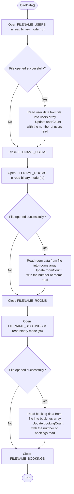

```c
void loadData() {
  FILE *fp;

  fp = fopen(FILENAME_USERS, "rb");
  if (fp != NULL) {
    userCount = fread(users, sizeof(User), MAX_USERS, fp);
    fclose(fp);
  }

  fp = fopen(FILENAME_ROOMS, "rb");
  if (fp != NULL) {
    roomCount = fread(rooms, sizeof(Room), MAX_ROOMS, fp);
    fclose(fp);
  }

  fp = fopen(FILENAME_BOOKINGS, "rb");
  if (fp != NULL) {
    bookingCount = fread(bookings, sizeof(Booking), MAX_BOOKINGS, fp);
    fclose(fp);
  }
}
```

```mermaid
flowchart LR
    subgraph loadData [loadData]
        direction TB
        LD(("loadData"))
        LD --> A((Load\nUsers))
        A --> B((Load\nRooms))
        B --> C((Load\nBookings))
        C --> end1(["End"])
    end

    subgraph LoadUsers [Load Users]
        direction TB
        LU(("Load\nUsers"))
        LU --> 1
        1["Open FILENAME_USERS in read binary mode (rb)"]
        1 --> 2
        2{"File opened successfully?"}
        2 -- Yes --> 3
        2 -- No --> 4
        3["Read user data from file into users array\nUpdate userCount with the number of users read"]
        3 --> 4
        4["Close FILENAME_USERS"]
    end

    subgraph LoadRooms [Load Rooms]
        direction TB
        LR(("Load\nRooms"))
        LR --> 5
        5["Open FILENAME_ROOMS in read binary mode (rb)"]
        5 --> 6
        6{"File opened successfully?"}
        6 -- Yes --> 7
        6 -- No --> 8
        7["Read room data from file into rooms array\nUpdate roomCount with the number of rooms read"]
        7 --> 8
        8["Close FILENAME_ROOMS"]
    end

    subgraph LoadBookings [Load Bookings]
        direction TB
        LB(("Load\nBookings"))
        LB --> 9
        9["Open FILENAME_BOOKINGS in read binary mode (rb)"]
        9 --> 10
        10{"File opened successfully?"}
        10 -- Yes --> 11
        10 -- No --> 12
        11["Read booking data from file into bookings array\nUpdate bookingCount with the number of bookings read"]
        11 --> 12
        12["Close FILENAME_BOOKINGS"]
    end
```




