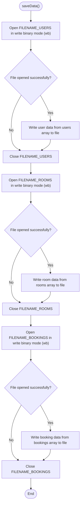

```c
void saveData() {
  FILE *fp;

  fp = fopen(FILENAME_USERS, "wb");
  if (fp != NULL) {
    fwrite(users, sizeof(User), userCount, fp);
    fclose(fp);
  }

  fp = fopen(FILENAME_ROOMS, "wb");
  if (fp != NULL) {
    fwrite(rooms, sizeof(Room), roomCount, fp);
    fclose(fp);
  }

  fp = fopen(FILENAME_BOOKINGS, "wb");
  if (fp != NULL) {
    fwrite(bookings, sizeof(Booking), bookingCount, fp);
    fclose(fp);
  }
}
```

```mermaid
flowchart LR
    subgraph saveData [saveData]
        direction TB
        SD(("saveData"))
        SD --> A((Save\nUsers))
        A --> B((Save\nRooms))
        B --> C((Save\nBookings))
        C --> end1(["End"])
    end

    subgraph SaveUsers [Save Users]
        direction TB
        SU(("Save\nUsers"))
        SU --> 1
        1["Open FILENAME_USERS in write binary mode (wb)"]
        1 --> 2
        2{"File opened successfully?"}
        2 -- Yes --> 3
        2 -- No --> 4
        3["Write user data from users array to file"]
        3 --> 4
        4["Close FILENAME_USERS"]
    end

    subgraph SaveRooms [Save Rooms]
        direction TB
        SR(("Save\nRooms"))
        SR --> 5
        5["Open FILENAME_ROOMS in write binary mode (wb)"]
        5 --> 6
        6{"File opened successfully?"}
        6 -- Yes --> 7
        6 -- No --> 8
        7["Write room data from rooms array to file"]
        7 --> 8
        8["Close FILENAME_ROOMS"]
    end

    subgraph SaveBookings [Save Bookings]
        direction TB
        SB(("Save\nBookings"))
        SB --> 9
        9["Open FILENAME_BOOKINGS in write binary mode (wb)"]
        9 --> 10
        10{"File opened successfully?"}
        10 -- Yes --> 11
        10 -- No --> 12
        11["Write booking data from bookings array to file"]
        11 --> 12
        12["Close FILENAME_BOOKINGS"]
    end
```




