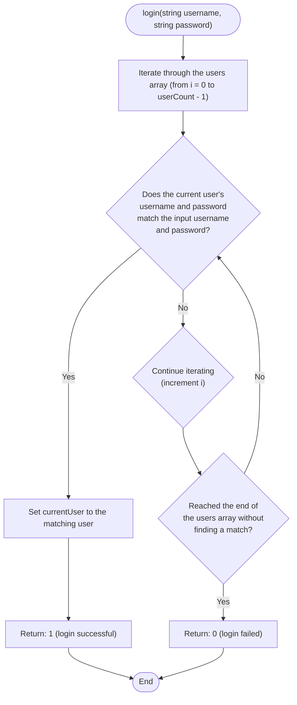

```c
int login(char *username, char *password) {
  for (int i = 0; i < userCount; i++) {
    if (strcmp(users[i].username, username) == 0 &&
        strcmp(users[i].password, password) == 0) {
      currentUser = users[i];
      return 1;
    }
  }
  return 0;
}
```


