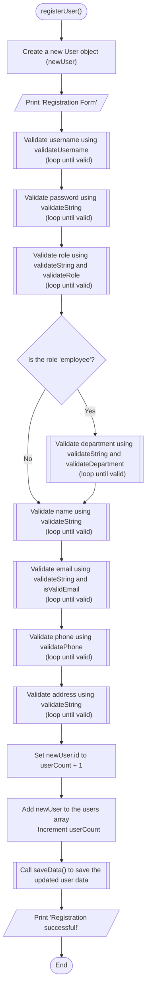

```c
void registerUser() {
  User newUser;
  char inputBuffer[200];

  printf("\nRegistration Form\n");

  while (true) {
    if (validateUsername(newUser.username, newUser.username,
                         sizeof(newUser.username))) {
      break;
    }
  }

  while (true) {
    if (validateString("Password", 5, 49, newUser.password,
                       sizeof(newUser.password))) {
      break;
    }
  }

  while (true) {
    if (validateString("Role (admin/employee/customer)", 1, 19, inputBuffer,
                       sizeof(inputBuffer))) {
      if (validateRole(inputBuffer)) {
        strncpy(newUser.role, inputBuffer, sizeof(newUser.role));
        break;
      } else {
        printf(
            "Invalid role. Please enter 'admin', 'employee', or 'customer'.\n");
      }
    }
  }

  if (strcmp(newUser.role, "employee") == 0) {
    while (true) {
      if (validateString("Department", 1, 49, inputBuffer,
                         sizeof(inputBuffer))) {
        if (validateDepartment(inputBuffer)) {
          strncpy(newUser.department, inputBuffer, sizeof(newUser.department));
          break;
        }
      }
    }
  }

  while (true) {
    if (validateString("Name", 1, 99, newUser.name, sizeof(newUser.name))) {
      break;
    }
  }

  while (true) {
    if (validateString("Email", 1, 99, inputBuffer, sizeof(inputBuffer))) {
      if (isValidEmail(inputBuffer)) {
        strncpy(newUser.email, inputBuffer, sizeof(newUser.email));
        break;
      } else {
        printf("Invalid email format.\n");
      }
    }
  }

  while (true) {
    if (validatePhone(newUser.phone, newUser.phone, sizeof(newUser.phone))) {
      break;
    }
  }

  while (true) {
    if (validateString("Address", 1, 199, newUser.address,
                       sizeof(newUser.address))) {
      break;
    }
  }

  newUser.id = userCount + 1;
  users[userCount++] = newUser;
  saveData();
  printf("\nRegistration successful!\n");
}
```

```mermaid
flowchart LR
    subgraph registerUser [registerUser]
        direction TB
        RU(("registerUser"))
        RU --> 1
        1["Create a new User object (newUser)"]
        1 --> 2
        2[/"Print 'Registration Form'"/]
        2 --> A((Validate\nUsername))
        A --> B((Validate\nPassword))
        B --> C((Validate\nRole))
        C --> 6
        6{"Is the role 'employee'?"}
        6 -- Yes --> D((Validate\nDepartment))
        6 -- No --> E((Validate\nName))
        D --> E
        E --> F((Validate\nEmail))
        F --> G((Validate\nPhone))
        G --> H((Validate\nAddress))
        H --> 12
        12["Set newUser.id to userCount + 1"]
        12 --> 13
        13["Add newUser to the users array\nIncrement userCount"]
        13 --> 14
        14[["Call saveData() to save the updated user data"]]
        14 --> 15
        15[/"Print 'Registration successful!'"/]
        15 --> end1(["End"])
    end

    subgraph ValidateUsername [Validate Username]
        direction TB
        VU(("Validate\nUsername"))
        VU --> 3
        3["Loop until valid:\nCall validateUsername\nwith newUser.username"]
        3 --> end2(["End"])
    end

    subgraph ValidatePassword [Validate Password]
        direction TB
        VP(("Validate\nPassword"))
        VP --> 4
        4["Loop until valid:\nCall validateString\nwith 'Password', 5, 49,\nnewUser.password"]
        4 --> end3(["End"])
    end

    subgraph ValidateRole [Validate Role]
        direction TB
        VR(("Validate\nRole"))
        VR --> 5
        5["Loop until valid:\nCall validateString\nwith 'Role (admin/employee/customer)',\n1, 19, inputBuffer\n- If valid, call validateRole\nwith inputBuffer\n- If valid role, copy inputBuffer\nto newUser.role"]
        5 --> end4(["End"])
    end

    subgraph ValidateDepartment [Validate Department]
        direction TB
        VD(("Validate\nDepartment"))
        VD --> 7
        7["Loop until valid:\nCall validateString\nwith 'Department', 1, 49, inputBuffer\n- If valid, call validateDepartment\nwith inputBuffer\n- If valid department,\ncopy inputBuffer to newUser.department"]
        7 --> end5(["End"])
    end

    subgraph ValidateName [Validate Name]
        direction TB
        VN(("Validate\nName"))
        VN --> 8
        8["Loop until valid:\nCall validateString\nwith 'Name', 1, 99, newUser.name"]
        8 --> end6(["End"])
    end

    subgraph ValidateEmail [Validate Email]
        direction TB
        VE(("Validate\nEmail"))
        VE --> 9
        9["Loop until valid:\nCall validateString\nwith 'Email', 1, 99, inputBuffer\n- If valid, call isValidEmail\nwith inputBuffer\n- If valid email,\ncopy inputBuffer to newUser.email"]
        9 --> end7(["End"])
    end

    subgraph ValidatePhone [Validate Phone]
        direction TB
        VPH(("Validate\nPhone"))
        VPH --> 10
        10["Loop until valid:\nCall validatePhone\nwith newUser.phone"]
        10 --> end8(["End"])
    end

    subgraph ValidateAddress [Validate Address]
        direction TB
        VA(("Validate\nAddress"))
        VA --> 11
        11["Loop until valid:\nCall validateString\nwith 'Address', 1, 199,\nnewUser.address"]
        11 --> end9(["End"])
    end
```




