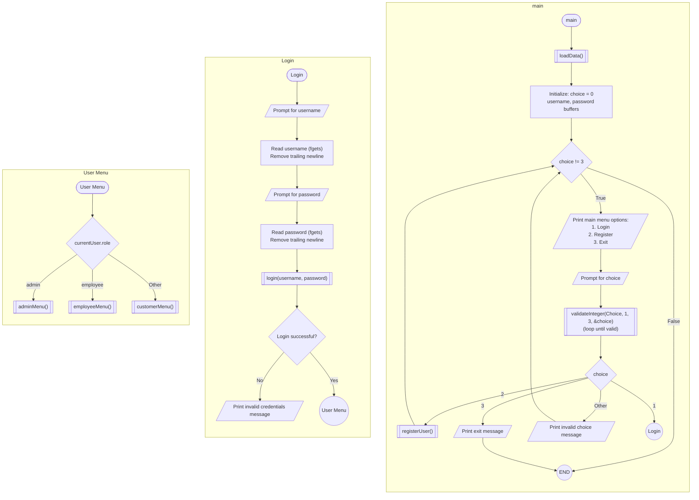

```c
int main() {
  loadData();
  int choice;
  char username[50], password[50];

  do {
    printf("\nHotel Management System\n");
    printf("1. Login\n");
    printf("2. Register\n");
    printf("3. Exit\n");
    printf("Choice: ");

    while (true) {
      if (validateInteger("Choice", 1, 3, &choice)) {
        break;
      }
    }

    switch (choice) {
    case 1:
      printf("\nLogin\n");
      printf("Username: ");
      fgets(username, sizeof(username), stdin);
      username[strcspn(username, "\n")] = 0; // Remove trailing newline

      printf("Password: ");
      fgets(password, sizeof(password), stdin);
      password[strcspn(password, "\n")] = 0; // Remove trailing newline

      if (login(username, password)) {
        printf("\nLogin successful!\n");
        if (strcmp(currentUser.role, "admin") == 0) {
          adminMenu();
        } else if (strcmp(currentUser.role, "employee") == 0) {
          employeeMenu();
        } else {
          customerMenu();
        }
      } else {
        printf("\nInvalid credentials!\n");
      }
      break;

    case 2:
      registerUser();
      break;

    case 3:
      printf("\nThank you for using our system!\n");
      break;

    default:
      printf("\nInvalid choice!\n");
    }
  } while (choice != 3);

  return 0;
}
```


