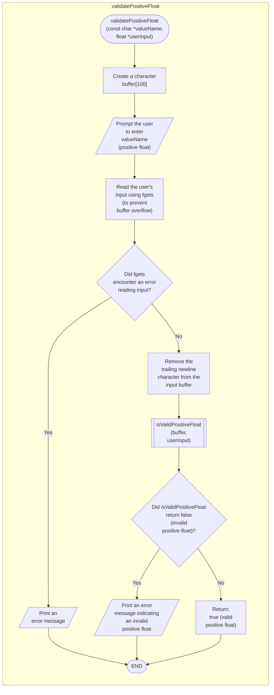

```c
bool validatePositiveFloat(const char *valueName, float *userInput) {
  char buffer[100];

  printf("Enter %s (positive float): ", valueName);

  if (fgets(buffer, sizeof(buffer), stdin) == NULL) {
    fprintf(stderr, "Error reading input.\n");
    return false;
  }

  buffer[strcspn(buffer, "\n")] = 0;

  if (!isValidPositiveFloat(buffer, userInput)) {
    printf("Invalid %s. Please enter a positive floating-point number.\n",
           valueName);
    return false;
  }

  return true;
}
```


