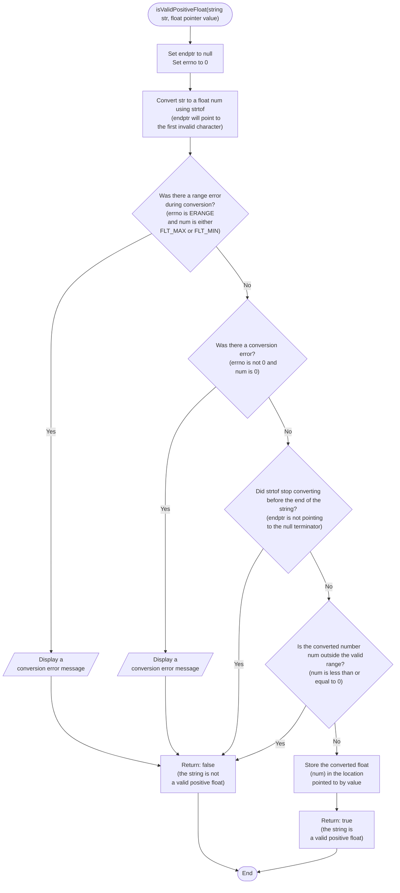

```c
bool isValidPositiveFloat(const char *str, float *value) {
  char *endptr;

  // Convert string to float
  errno = 0;
  float num = strtof(str, &endptr);

  // Check for conversion errors
  if ((errno == ERANGE && (num == FLT_MAX || num == FLT_MIN)) ||
      (errno != 0 && num == 0)) {
    perror("strtof");
    return false;
  }

  // Check if the entire string was consumed
  if (*endptr != '\0') {
    return false;
  }

  // Check for positive value
  if (num <= 0) {
    return false;
  }

  *value = num;
  return true;
}
```


