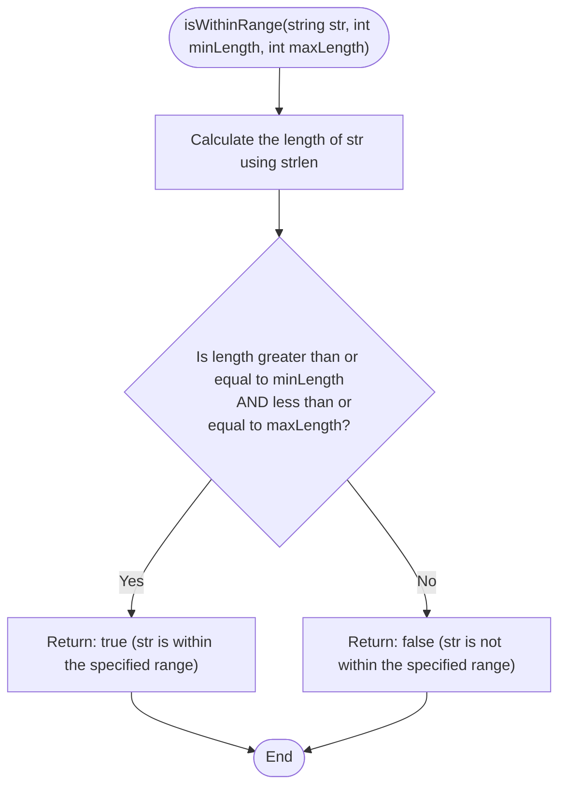

```c
bool isWithinRange(const char *str, int minLength, int maxLength) {
  int len = strlen(str);
  return len >= minLength && len <= maxLength;
}
```


```mermaid
flowchart TB
    start(["isWithinRange(string str, int minLength, int maxLength)"])
    start --> 1

    1["Calculate the length of str using strlen"]
    1 --> 2

    2{"Is length greater than or equal to minLength
        AND less than or equal to maxLength?"}
    2 -- Yes --> 3
    2 -- No --> 4

    3["Return: true (str is within the specified range)"]
    3 --> end1

    4["Return: false (str is not within the specified range)"]
    4 --> end1

    end1(["End"])
```
