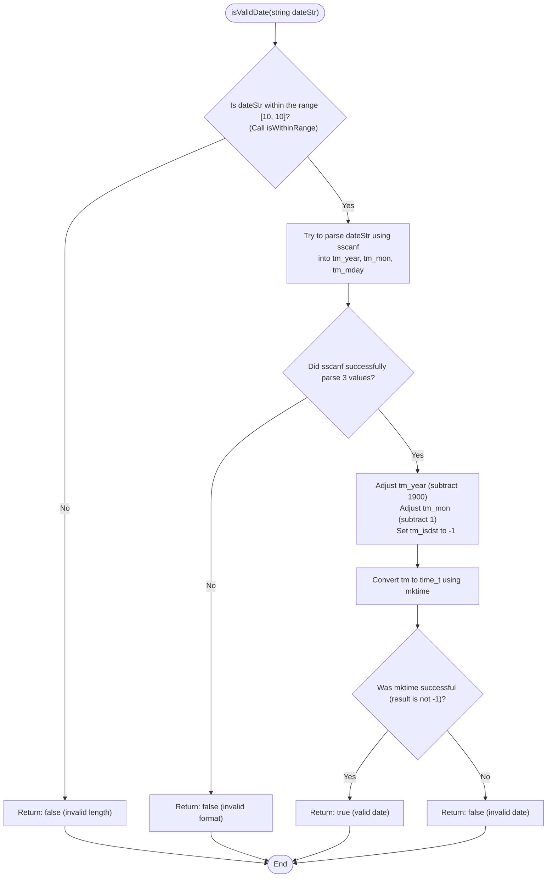

```c
bool isValidDate(const char *dateStr) {
  struct tm tm;

  // Check if date string is the right length
  if (!isWithinRange(dateStr, 10, 10)) {
    return false;
  }

  // Try to parse the date string
  if (sscanf(dateStr, "%d-%d-%d", &tm.tm_year, &tm.tm_mon, &tm.tm_mday) != 3) {
    return false;
  }

  // Adjust year and month for struct tm
  tm.tm_year -= 1900;
  tm.tm_mon -= 1;
  tm.tm_isdst = -1;

  // Check if the date is valid using mktime
  time_t t = mktime(&tm);
  if (t == -1) {
    return false;
  }

  return true;
}
```


